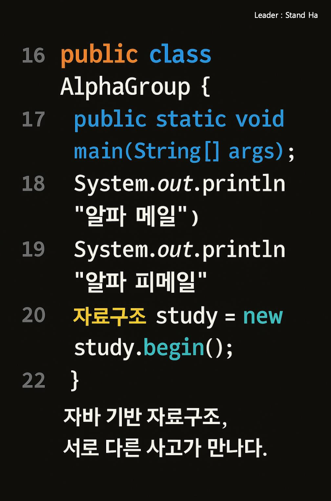

# 🚀 [Alphamale-Alphafemale_DS] : 자료구조 스터디 🚀

  

# 💻 Data Structure-study

## 🗒️ 스터디 방식

#### 1. 개인 알고리즘 스터디 방식
- 본인의 '이름' 폴더를 생성하여 자료구조 학습 및 문제 풀이한 소스 코드 파일들 자유롭게 업로드

 

#### 2. 단체 알고리즘 미션 방식
- `매주 월요일` 새로운 미션이 올라옵니다.
- 미션을 해결하고 `일요일 저녁`까지 본인의 폴더 내, '미션' > '날짜-주차' 형식의 폴더에 코드들을 업로드 합니다. (ex : '2021-08-02주차')

 

## 🧷 개인 폴더 만드는 법
1. 오른쪽 상단 `Fork` 누른 뒤 개인 repositories에 넣기  
2. 개인 repositories에 있는 `algorithm-study`에 들어가서 `Add file`  
3. `Create new file` 누른 후 `(자신의 이름/readme.md)` 경로 입력 후 코드 작성  
4. `Pull requests`에서 `Merge` 눌러 적용!
